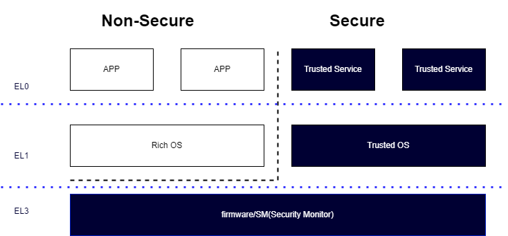
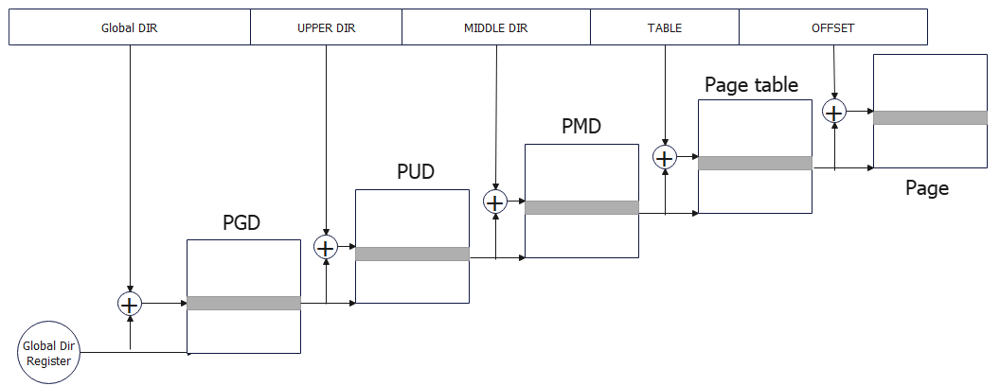
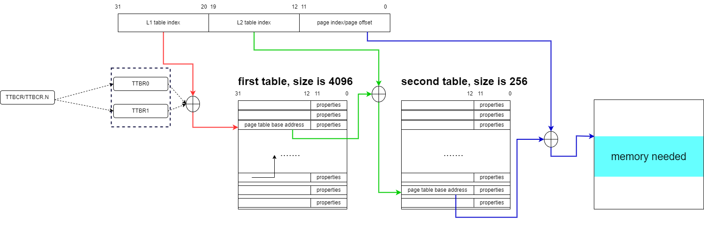
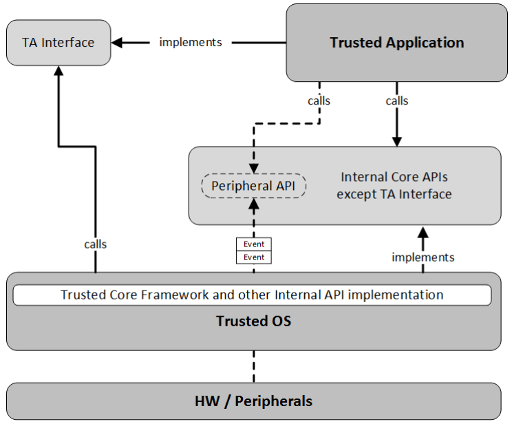
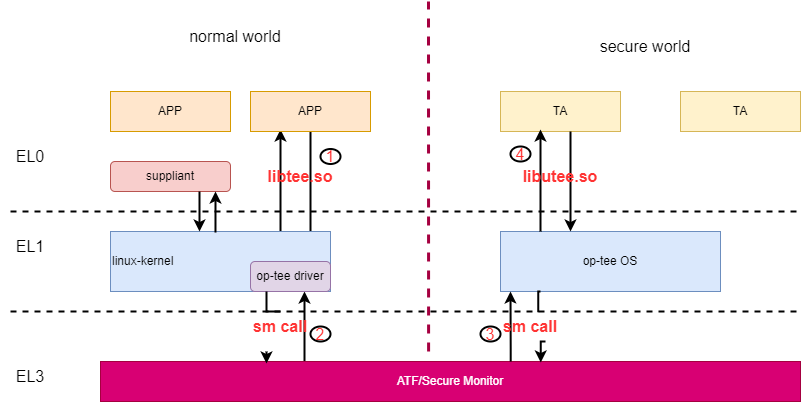
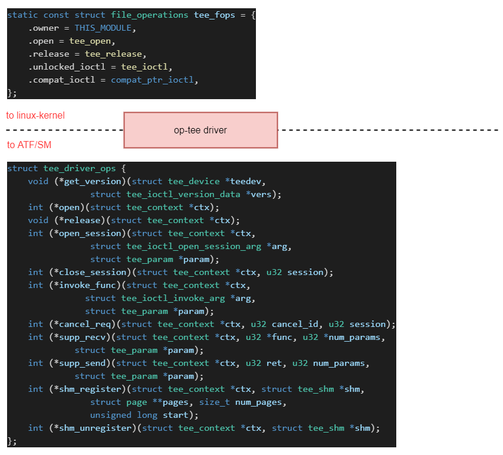
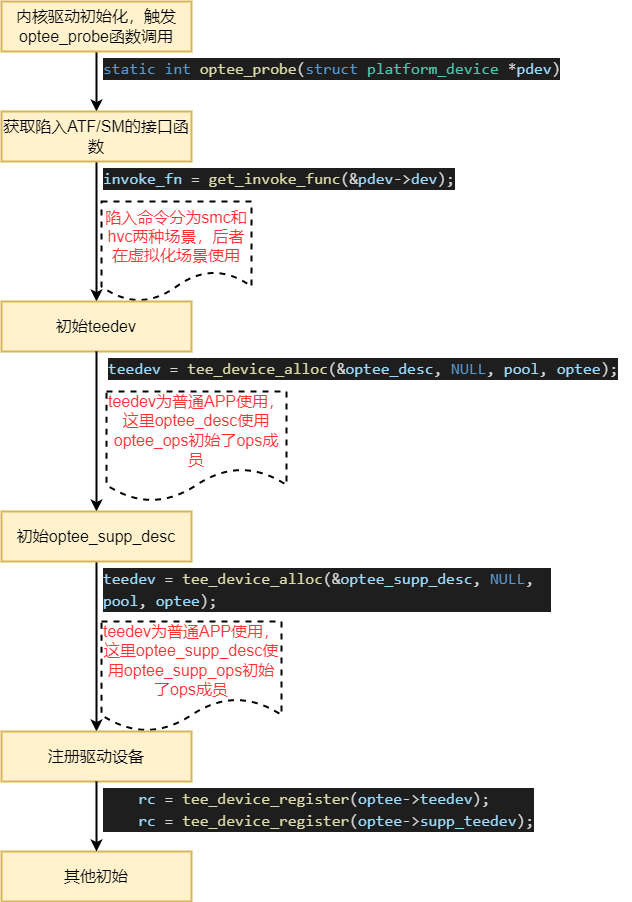
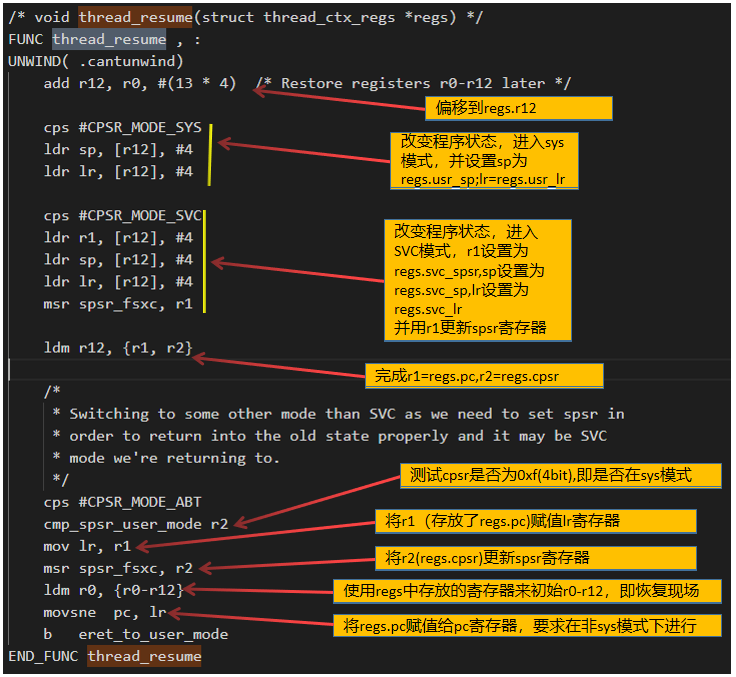
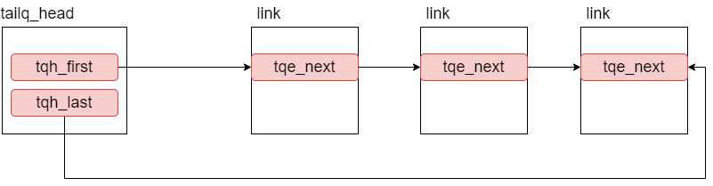
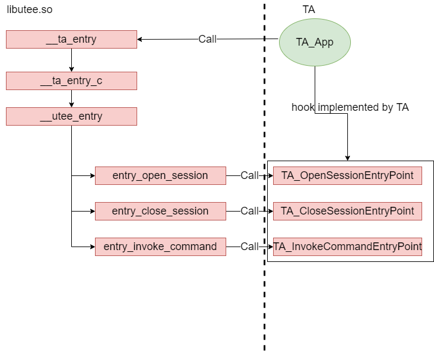

# TrustZone和OP-TEE 学习研究


前言：

最近学习TrustZone和GlobalPlatform定义的TEE，及其相关的API，为了更好的理解TEE的运行机制，为此针对开源的op-tee代码进行了分析和总结。


## 1.TrustZone 和TA Interface

### 1.1 TrustZone 整体架构

ARM提出来TrustZone的概念，将运行环境分为安全和非安全两部分，安全执行TEE（Trusted Excution Environment）由TrustZone硬件和Trusted OS构成。

ARM的trustzone架构如下：



处理器通过系统配置寄存器SCR.NS(security configure register-Non-Secure-bit)的取值来判断当前cpu处于安全状态还是非安全状态

SCR.NS的设置由firmware（通常为ATF，Arm Trusted Firmware）或者security monitor中完成，并且只能在EL3的级别上完成状态的切换。切换的简单逻辑步骤如下：

非安全到安全：

- 保存非安全世界的寄存器
- 恢复安全世界的寄存器
- 设置SCR.NS=0（切换到安全状态）

安全到非安全：

- 保存安全世界的寄存器
- 恢复非安全世界的寄存器
- 设置SCR.NS=1(切换到非安全状态)

### 1.2 ARM-TEE整体架构


几点说明：

- 非安全世界的Application不能直接调用安全世界的service，必须通过封装的API，通过底层驱动触发SMC或者中断请求来完成服务器请求。
- 安全世界和非安全世界的消息通信是如何进行的？因为安全世界和非安全世界的内存是物理隔离的？但是安全世界可以查看非安全世界的内存，**因此通信的消息只能存放在非安全世界中**，并通过底层的MailBox或者msg buffer机制完成。
- 安全世界和非安全世界的消息通信引发另一个问题，即安全世界收到来自非安全世界的消息，可能是恶意的，应该保持对消息的认证和安全校验。如何认证消息和鉴权消息？
- CPU的状态要么是安全的，要么是非安全的？那么安全TEE是如何运行的？arm建议的一个可行的方案是，在非安全世界运行一个daemon，该daemon通过API控制SM，并控制TEE的运行。这个方案的缺点时可能导致可用性存在风险，但是不会产生信息泄露。

### 1.3 内存的安全状态和非安全状态划分

内存访问有两种方式分段和分页，也可以是两者的结合。在linux中采用了分页内存管理机制，在Linux分页机制中存在如下集中变量，PGD（page global Directory)、PUD(page upper Directory)、PMD(page middle Directory)和PTE(page table)。内存MMU通过输入的虚拟地址，通过PGD找到PUD，通过PUD找到PMD，让后通过PMD找到PT，最终在PT中找到具体的物理地址。



在ARM中存在两个寄存器TTBR0和TTBR1用于存放PGD，并通过TTBCR.N控制了系统在执行地址转换时采用那个寄存处，其规则如下：

- TTBCR.N=0,那么系统使用TTBR0
- TTBCR.N不为0，此时如果虚拟地址va[31:32-N]位0，那么系统使用TTBR0，如果va[31:32-N]为1，那么系统使用TTBR1。

以ARMv7 32为例，地址转换采用了2段寻址，其中分配位12+8+12的组合，即PUD的大小为1，PMD的大小位4096，PTE的大小位256，内存page的大小位4k（4096）。

因此地址转换如下图所示，转换的步骤如下：

- 从TTBRx基础获得translation base address地址14-31bit位(即PGD），转换地址的低14bit位为0，这个值+va[31:20]定位到page table地址
- 获得page table地址+va[19:12]得到PTE，PTE里面存放了物理地址PA
- 获得PA+va[11:0]得到真实的物理地址。



那么在安全状态和非安全状态，内存是如何隔离的？

ARM提供了机制可以将内存分位安全区域和非安全区域。在TTBR0寄存器中存在标志位确定当前基地址时安全的还非安全。其次指向page table的地址中也NS标志位，当NS标志位0表明引用的安全区域内存。

根据规则，安全状态下也可以方位安全和非安全的内存；但是在非安全状态下，只能访问非安全的内存。如果非安全访问安全的内存，会导致fault。

需要注意的是，在安全状态和非安全状态下，TTBR0、TTBR1、TTBCR等寄存器是独立的，即物理上一份，但是两种状态有各自的值。

对于内存划分不同的安全状态，通过TZASC（trustzone address space control）来实现。TZASC类似MPU（memory protect unit）决定内存的访问权限。


参考：

http://developer.arm.com/documentation/102418/latest/

### 1.4 TEE 软件架构



Trusted Application(TA)需要实现如下的接口：

* TEE_Result TA_EXPORT **TA_CreateEntryPoint**( void );

* void TA_EXPORT **TA_DestroyEntryPoint**( void );

* TEE_Result TA_EXPORT **TA_OpenSessionEntryPoint**(  
  uint32_t paramTypes,  
  [inout] TEE_Param params[4],  
  [out][ctx] void** sessionContext );

* void TA_EXPORT **TA_CloseSessionEntryPoint**(  
  [ctx] void* sessionContext);

* TEE_Result TA_EXPORT **TA_InvokeCommandEntryPoint**(  
  [ctx] void* sessionContext,  
  uint32_t commandID,  
  uint32_t paramTypes,  
  [inout] TEE_Param params[4] );

TA实现TA Interface，但是可以调用接口，如TEE_CipherInit、TEE_CipherUpdate和TEE_CipherDoFinal来请求Trusted OS执行TEE服务。

以TEE_CipherDoFinal为例，最终会调用系统调用接口_utee_cipher_final请求TrustedOS服务。其syscall定义如下：

> UTEE_SYSCALL _utee_cipher_final, TEE_SCN_CIPHER_FINAL, 5

参考：

[OP-TEE · GitHub](https://github.com/OP-TEE/)

[Documentation – Arm Developer-ARM TrustZone](https://developer.arm.com/documentation/102418/0101/Software-architecture)

[TEE Internal Core API Specification v1.3.1 | GPD_SPE_010](https://globalplatform.org/specs-library/tee-internal-core-api-specification/#)

## 2. OP-TEE架构



通过对代码分析op-tee实现的架构，理清楚安全世界（normal world)和安全世界（secure world）是如何进行交互的。我们从如下4个方面入手：

* 在normal世界用户态空间的APP是如何请求TA服务器的？

* 在normal world中，内核driver是如何工作的？

* 内核是如何陷入SM（secure Monitor）或者ATF中的？

* ATF如何将请求传递给op-tee OS，并且触发TA进行服务

* TA完成任务后，如何进行返回。

其次，安全世界和非安全世界如何进行消息交互的。

为了更好的理解，我们先了解op-tee driver架构，然后学习libtee.so的实现，最后深入op-tee OS学习TA的管理机制，并同时研究libutee.so的实现。

## 3.op-tee driver 架构

tee驱动架构已集成到linux版本中，我们选择linux-5.11.17版本

op-tee driver架构可以分层2个部分，一个是面向linux-kernel接口，完成用户态请求（syscall调用）即注册file_operations实现; 另一个是面向ATF/SM，实现将请求传递到安全世界，通过注册tee_driver_ops接口实现。



内核驱动会初始化2类驱动，一个为普通的APP使用，另一个则是为suppliant使用。

该初始化可以在optee_probe函数函数中定义实现。调用关系如下：



进一步分析可以得到，普通驱动对应到文件/dev/optee-clnt，而suppliant使用的驱动文件为/dev/optee-supp;因此可以通过open()，ioctrl和close来触发驱动代码逻辑执行。

optee-clnt定义如下：

```c
static const struct tee_driver_ops optee_ops = {
    .get_version = optee_get_version,
    .open = optee_open,
    .release = optee_release,
    .open_session = optee_open_session,
    .close_session = optee_close_session,
    .invoke_func = optee_invoke_func,
    .cancel_req = optee_cancel_req,
    .shm_register = optee_shm_register,
    .shm_unregister = optee_shm_unregister,
};

static const struct tee_desc optee_desc = {
    .name = DRIVER_NAME "-clnt",
    .ops = &optee_ops,
    .owner = THIS_MODULE,
};
```

optee-supp定义如下：

```c
static const struct tee_driver_ops optee_supp_ops = {
    .get_version = optee_get_version,
    .open = optee_open,
    .release = optee_release,
    .supp_recv = optee_supp_recv,
    .supp_send = optee_supp_send,
    .shm_register = optee_shm_register_supp,
    .shm_unregister = optee_shm_unregister_supp,
};

static const struct tee_desc optee_supp_desc = {
    .name = DRIVER_NAME "-supp",
    .ops = &optee_supp_ops,
    .owner = THIS_MODULE,
    .flags = TEE_DESC_PRIVILEGED,
};
```

ioctl代码逻辑

```c
static long tee_ioctl(struct file *filp, unsigned int cmd, unsigned long arg)
{
    struct tee_context *ctx = filp->private_data;
    void __user *uarg = (void __user *)arg;

    switch (cmd) {
    case TEE_IOC_VERSION:
        return tee_ioctl_version(ctx, uarg);
    case TEE_IOC_SHM_ALLOC:
        return tee_ioctl_shm_alloc(ctx, uarg);
    case TEE_IOC_SHM_REGISTER:
        return tee_ioctl_shm_register(ctx, uarg);
    case TEE_IOC_OPEN_SESSION:
        return tee_ioctl_open_session(ctx, uarg);
    case TEE_IOC_INVOKE:
        return tee_ioctl_invoke(ctx, uarg);
    case TEE_IOC_CANCEL:
        return tee_ioctl_cancel(ctx, uarg);
    case TEE_IOC_CLOSE_SESSION:
        return tee_ioctl_close_session(ctx, uarg);
    case TEE_IOC_SUPPL_RECV:
        return tee_ioctl_supp_recv(ctx, uarg);
    case TEE_IOC_SUPPL_SEND:
        return tee_ioctl_supp_send(ctx, uarg);
    default:
        return -EINVAL;
    }
}
```

还存在一个问题，linux kernel是如何陷入到ATF/SM中的。

以tee_ioctl_open_session为例，分析得到如下的调用关系：

```c
static int tee_ioctl_open_session(struct tee_context *ctx,
                  struct tee_ioctl_buf_data __user *ubuf))
->rc = ctx->teedev->desc->ops->open_session(ctx, &arg, params);
#这里会触发optee_ops->.open_session = optee_open_session的调用
->optee_do_call_with_arg(ctx, msg_parg)
->optee->invoke_fn(param.a0, param.a1, param.a2, param.a3,
                 param.a4, param.a5, param.a6, param.a7,
                 &res);#其中invoke_fn或者为optee_smccc_smc或者optee_smccc_hvc。
->static void optee_smccc_smc(unsigned long a0, unsigned long a1,
                unsigned long a2, unsigned long a3,
                unsigned long a4, unsigned long a5,
                unsigned long a6, unsigned long a7,
                struct arm_smccc_res *res)；
->arm_smccc_smc(a0, a1, a2, a3, a4, a5, a6, a7, res);
->smc #0
```

其中，arm_smccc_smc的定义如下

> #define arm_smccc_smc(...) __arm_smccc_smc(__VA_ARGS__, NULL)

详细定义如下所示：

```c
    /*
     * Wrap c macros in asm macros to delay expansion until after the
     * SMCCC asm macro is expanded.
     */
    .macro SMCCC_SMC
    __SMC(0)
    .endm

    .macro SMCCC_HVC
    __HVC(0)
    .endm

    .macro SMCCC instr
UNWIND(    .fnstart)
    mov    r12, sp
    push    {r4-r7}
UNWIND(    .save    {r4-r7})
    ldm    r12, {r4-r7}
    \instr
    pop    {r4-r7}
    ldr    r12, [sp, #(4 * 4)]
    stm    r12, {r0-r3}
    bx    lr
UNWIND(    .fnend)
    .endm

/*
 * void smccc_smc(unsigned long a0, unsigned long a1, unsigned long a2,
 *          unsigned long a3, unsigned long a4, unsigned long a5,
 *          unsigned long a6, unsigned long a7, struct arm_smccc_res *res,
 *          struct arm_smccc_quirk *quirk)
 */
ENTRY(__arm_smccc_smc)
    SMCCC SMCCC_SMC
ENDPROC(__arm_smccc_smc)
```

arm-32定义__SMC (0)

#define __SMC(imm4) __inst_arm_thumb32(                 \

    0xE1600070 | (((imm4) & 0xF) << 0),             \

    0xF7F08000 | (((imm4) & 0xF) << 16)             \

)

arm64定义如下：

```c
SYM_FUNC_START(__arm_smccc_smc)
    SMCCC    smc
SYM_FUNC_END(__arm_smccc_smc)
EXPORT_SYMBOL(__arm_smccc_smc)

    .macro SMCCC instr
    \instr    #0
    ldr    x4, [sp]
    stp    x0, x1, [x4, #ARM_SMCCC_RES_X0_OFFS]
    stp    x2, x3, [x4, #ARM_SMCCC_RES_X2_OFFS]
    ldr    x4, [sp, #8]
    cbz    x4, 1f /* no quirk structure */
    ldr    x9, [x4, #ARM_SMCCC_QUIRK_ID_OFFS]
    cmp    x9, #ARM_SMCCC_QUIRK_QCOM_A6
    b.ne    1f
    str    x6, [x4, ARM_SMCCC_QUIRK_STATE_OFFS]
1:    ret
    .endm
```

arm64直接调用smc指令

## 4. TEE Client软件架构

libtee.so 实现了TEE定义的Client API接口，所有的实现方式最终都通过调用tee-driver的ioctl接口来实现：

**TEEC_InitializeContext**

```c
TEEC_Result TEEC_InitializeContext(const char *name, TEEC_Context *ctx)
->fd = teec_open_dev(devname, name, &gen_caps);
->fd = open(devname, O_RDWR);
```

**TEEC_FinalizeContext**

```c
void TEEC_FinalizeContext(TEEC_Context *ctx)
->close(ctx->fd);
```

**TEEC_OpenSession**

```c
TEEC_Result TEEC_OpenSession(TEEC_Context *ctx, TEEC_Session *session,

            const TEEC_UUID *destination,

            uint32_t connection_method, const void *connection_data,

            TEEC_Operation *operation, uint32_t *ret_origin)

rc = ioctl(ctx->fd, TEE_IOC_OPEN_SESSION, &buf_data);
```

**TEEC_CloseSession**

```c
void TEEC_CloseSession(TEEC_Session *session)

ioctl(session->ctx->fd, TEE_IOC_CLOSE_SESSION, &arg)
```

**TEEC_InvokeCommand**

```c
TEEC_Result TEEC_InvokeCommand(TEEC_Session *session, uint32_t cmd_id,

            TEEC_Operation *operation, uint32_t *error_origin)

rc = ioctl(session->ctx->fd, TEE_IOC_INVOKE, &buf_data);
```

**TEEC_RequestCancellation**

```c
void TEEC_RequestCancellation(TEEC_Operation *operation)

ioctl(session->ctx->fd, TEE_IOC_CANCEL, &arg)
```

**TEEC_RegisterSharedMemory**

```c
TEEC_Result TEEC_RegisterSharedMemory(TEEC_Context *ctx, TEEC_SharedMemory *shm)

fd = teec_shm_register(ctx->fd, shm->shadow_buffer, s,

                       &shm->id);

shm_fd = ioctl(fd, TEE_IOC_SHM_REGISTER, &data);
```

1、通常请求下，TEEC_OpenSession请求会触发TEEC_InitializeContext接口的调用

2、TA的client 除了有normal世界的Application外，TA直接也可以进行服务请求。TA调用TA请求的API接口定义如下：

- TEE_OpenTASession

- TEE_InvokeTACommand

- TEE_CloseTASession

本次不分析TA之间的服务请求。

## 5.SMC指令

SMC（Secure Monitor Call）用于在安全世界和非安全世界进行切换，SMC会根据当前的上下文安全状态，比如 NS位，来确定切换方向（安全->非安全，或者非安全->安全）。调用SMC指令后，系统会进入ATF或者secure monitor进行状态切换，即在非安全世界调用SMC指令会进入ATF/SM

以32位的为例，SMC32位的调用规范：

* r0存放functionID

* r1-r7存放参数

* 返回结果存放在r0-r7

* r4和r7必须被保存，除非用于保存结果

* r8-r14 需要通过被调用函数保存

SMC32 在64位系统上的调用规范：

- w0存放functionID

- w1-w7存放参数

- 返回结果存放在w0-w7

- w4和w7必须被保存，除非用于保存结果

- x8-x30,SP_EL0,SP_ELx 需要通过被调用函数保存

SMC的function功能ID

| 类型                                     | 功能                                            |
| -------------------------------------- | --------------------------------------------- |
| TEESMC_OPTEED_RETURN_ENTRY_DONE        | returning from initial entry：用于注册消息处理函数       |
| TEESMC_OPTEED_RETURN_ON_DONE           | returning from "cpu_on" vector                |
| TEESMC_OPTEED_RETURN_OFF_DONE          | returning from "cpu_off" vector               |
| TEESMC_OPTEED_RETURN_SUSPEND_DONE      | returning from "cpu_suspend" vector           |
| TEESMC_OPTEED_RETURN_RESUME_DONE       | returning from "cpu_resume" vector            |
| TEESMC_OPTEED_RETURN_CALL_DONE         | returning from "std_smc" or "fast_smc" vector |
| TEESMC_OPTEED_RETURN_FIQ_DONE          | returning from "fiq" vector                   |
| TEESMC_OPTEED_RETURN_SYSTEM_OFF_DONE   | returning from "system_off" vector            |
| TEESMC_OPTEED_RETURN_SYSTEM_RESET_DONE | returning from "system_reset" vector          |

更多详细内容，可以参考《DEN0028E_SMC_Calling_Convention_1_4bet1.pdf》

## 6.ATF切换到optee-OS

### 6.1消息处理函数注册分析

通过SMC的FunctionID可知，TEESMC_OPTEED_RETURN_ENTRY_DONE用于在初始时向ATF注册消息处理函数向量表，即thread_vector_table。

其初始流程如下(以32位为例）：

```s
_start

->reset_primary    

->ldr    r1, =thread_vector_table

->mov    r0, #TEESMC_OPTEED_RETURN_ENTRY_DONE

->smc    #0
```

thread_vector_table的定义如下：

```c
struct thread_vector_table {
    uint32_t std_smc_entry;
    uint32_t fast_smc_entry;
    uint32_t cpu_on_entry;
    uint32_t cpu_off_entry;
    uint32_t cpu_resume_entry;
    uint32_t cpu_suspend_entry;
    uint32_t fiq_entry;
    uint32_t system_off_entry;
    uint32_t system_reset_entry;
};

extern struct thread_vector_table thread_vector_table;
```

初始在core\arch\arm\kernel\thread_optee_smc_a32.S进行了初始化

```c
FUNC thread_vector_table , : , .identity_map
UNWIND(    .cantunwind)
    b    vector_std_smc_entry
    b    vector_fast_smc_entry
    b    vector_cpu_on_entry
    b    vector_cpu_off_entry
    b    vector_cpu_resume_entry
    b    vector_cpu_suspend_entry
    b    vector_fiq_entry
    b    vector_system_off_entry
    b    vector_system_reset_entry
END_FUNC thread_vector_table
DECLARE_KEEP_PAGER thread_vector_table
```

因此在ATF中处理标准smc请求，最终会调用vector_std_smc_entry进行处理，接下来分析该函数的处理逻辑和optee-os内部的函数流程。

### 6.2vector_std_smc_entry函数分析

函数主体：

```c
FUNC vector_std_smc_entry , : , .identity_map
UNWIND(    .cantunwind)
    readjust_pc
    push    {r4-r7}
    bl    thread_handle_std_smc
    add    sp, sp, #(4 * 4)
    /*
     * Normally thread_handle_std_smc() should return via
     * thread_exit(), thread_rpc(), but if thread_handle_std_smc()
     * hasn't switched stack (error detected) it will do a normal "C"
     * return.
     */
    mov    r1, r0
    ldr    r0, =TEESMC_OPTEED_RETURN_CALL_DONE
    smc    #0
    /* SMC should not return */
    panic_at_smc_return
END_FUNC vector_std_smc_entry
```

主要逻辑如下：

1、arm32使用r0-r3进行参数传递，超过部分通过stack进行传递，但是SMC通过寄存器进行参数传递，因此需要将其他参数加入到stack中

2、调用thread_handle_std_smc进行消息处理。

3、将返回值保存到r1，因为r0需要保存smc的functionID

4、设置r0的functionID为TEESMC_OPTEED_RETURN_CALL_DONE，表明已完成消息处理了

5、执行smc，返回到非安全世界。

thread_handle_std_smc有两个功能：

* 调用函数thread_alloc_and_run为新的TEE TA服务请求选择thread，设置相应的register，并指定pc为thread_std_smc_entry。thread的数量可配置为1,4,8或者16。当没有空闲的thread时，系统返回OPTEE_SMC_RETURN_ETHREAD_LIMIT。

* 调用thread_resume_from_rpc恢复已有的TEE TA服务请求。这里不需要初始化thread.regs, 更不用设置pc。

不管是处理新请求，还是恢复老请求，最后都通过thread_resume完成thread执行环境恢复。

thread_handle_std_smc比较特殊，如果它调用函数失败，从该函数return。否则会从函数thread_exit()或者thread_rpc()返回。


init_regs函数的逻辑比较简单，初始化thread的寄存器，并设置cpsr（当前处理状态寄存器的值）

```c
static void init_regs(struct thread_ctx *thread, uint32_t a0, uint32_t a1,
              uint32_t a2, uint32_t a3, uint32_t a4, uint32_t a5,
              uint32_t a6, uint32_t a7, void *pc)
{
    thread->regs.pc = (uint32_t)pc;

    /*
     * Stdcalls starts in SVC mode with masked foreign interrupts, masked
     * Asynchronous abort and unmasked native interrupts.
     */
    thread->regs.cpsr = read_cpsr() & ARM32_CPSR_E;
    thread->regs.cpsr |= CPSR_MODE_SVC | CPSR_A |
            (THREAD_EXCP_FOREIGN_INTR << ARM32_CPSR_F_SHIFT);
    /* Enable thumb mode if it's a thumb instruction */
    if (thread->regs.pc & 1)
        thread->regs.cpsr |= CPSR_T;
    /* Reinitialize stack pointer */
    thread->regs.svc_sp = thread->stack_va_end;

    /*
     * Copy arguments into context. This will make the
     * arguments appear in r0-r7 when thread is started.
     */
    thread->regs.r0 = a0;
    thread->regs.r1 = a1;
    thread->regs.r2 = a2;
    thread->regs.r3 = a3;
    thread->regs.r4 = a4;
    thread->regs.r5 = a5;
    thread->regs.r6 = a6;
    thread->regs.r7 = a7;
}
```

### 6.3thread_resume函数分析

还是以32位为例（core\arch\arm\kernel\thread_a32.S）

在分析thread_resume之前，先看下thread_ctx和thread_ctx_regs定义

```c
struct thread_ctx {
    struct thread_ctx_regs regs;
    enum thread_state state;
    vaddr_t stack_va_end;
    uint32_t flags;
    struct core_mmu_user_map user_map;
    bool have_user_map;
#ifdef ARM64
    vaddr_t kern_sp;    /* Saved kernel SP during user TA execution */
#endif
#ifdef CFG_WITH_VFP
    struct thread_vfp_state vfp_state;
#endif
    void *rpc_arg;
    struct mobj *rpc_mobj;
    struct thread_shm_cache shm_cache;
    struct thread_specific_data tsd;
};
```

暂时只关心regs，其定义如下：

```c
struct thread_ctx_regs {
    uint32_t r0;
    uint32_t r1;
    uint32_t r2;
    uint32_t r3;
    uint32_t r4;
    uint32_t r5;
    uint32_t r6;
    uint32_t r7;
    uint32_t r8;
    uint32_t r9;
    uint32_t r10;
    uint32_t r11;
    uint32_t r12;
    uint32_t usr_sp;
    uint32_t usr_lr;
    uint32_t svc_spsr;
    uint32_t svc_sp;
    uint32_t svc_lr;
    uint32_t pc;
    uint32_t cpsr;
};
```

thread_resume代码如下：

```c
/* void thread_resume(struct thread_ctx_regs *regs) */
FUNC thread_resume , :
UNWIND(    .cantunwind)
    add    r12, r0, #(13 * 4)    /* Restore registers r0-r12 later */

    cps    #CPSR_MODE_SYS
    ldr    sp, [r12], #4
    ldr    lr, [r12], #4

    cps    #CPSR_MODE_SVC
    ldr    r1, [r12], #4
    ldr    sp, [r12], #4
    ldr    lr, [r12], #4
    msr    spsr_fsxc, r1

    ldm    r12, {r1, r2}

    /*
     * Switching to some other mode than SVC as we need to set spsr in
     * order to return into the old state properly and it may be SVC
     * mode we're returning to.
     */
    cps    #CPSR_MODE_ABT
    cmp_spsr_user_mode r2
    mov    lr, r1
    msr    spsr_fsxc, r2
    ldm    r0, {r0-r12}
    movsne    pc, lr
    b    eret_to_user_mode
END_FUNC thread_resume
```

函数解析如下：



需要注意：在非sys模式下，会直接通过movsne pc,lr 切换程序流程；否则会执行eret_to_user_mode，在init_regs函数中，cpsr赋值了CPSR_MODE_SVC，因此对于初始请求任务，会进入eret_to_user_mode进行处理

_Note_:

> - ldr r1, [r12], #4：将r12+4指向的内存内容存放在r1中，并且更新r12=r12+4
> 
> - cps #CPSR_MODE_SYS：cps-change processor state，用于改变cpu的状态，CPSR_MODE_SYS=0x1f，是system模式，可以和用户态共享寄存器；SVC模式为supervisor call 模式，当有svc call 的时候进入；ABT模式为内存访问异常时进入
> 
> - msr spsr_fsxc, r1：将r1中的值存放在spsr_fsxc中，对应的指令mrs,格式为mrs r1,spsr 将spsr的取值读取到r1中。
> 
> - ldm r12, {r1, r2}：将r12指向的内存内容，存放到r1和r2中
> 
> - cpsr：当前程序状态寄存器，spsr：为备份的程序状态寄存器，可以用他来进行恢复。

### 6.4eret_to_user_mode和thread_std_smc_entry

eret_to_user_mode会进行一些配置后，最后执行movs pc,lr

此时的lr取值为regs.pc，即为thread_std_smc_entry（定义在core\arch\arm\kernel\thread_optee_smc_a32.S）,其最终会调用__tee_entry_std函数

调用关系如下：

> thread_std_smc_entry
> 
> ->__thread_std_smc_entry
> 
> ->std_smc_entry(a0, a1, a2, a3)
> 
> ->std_entry_with_parg
> 
> ->rv = call_entry_std(arg, num_params, rpc_arg);#rpc_arg为False
> 
> ->tee_entry_std(arg, num_params)
> 
> ->__tee_entry_std(arg, num_params);

__tee_entry_std是一个中转函数，处理不同类别的请求，定义如下：

```c
TEE_Result __tee_entry_std(struct optee_msg_arg *arg, uint32_t num_params)
{
    TEE_Result res = TEE_SUCCESS;

    /* Enable foreign interrupts for STD calls */
    thread_set_foreign_intr(true);
    switch (arg->cmd) {
    case OPTEE_MSG_CMD_OPEN_SESSION:
        entry_open_session(arg, num_params);
        break;
    case OPTEE_MSG_CMD_CLOSE_SESSION:
        entry_close_session(arg, num_params);
        break;
    case OPTEE_MSG_CMD_INVOKE_COMMAND:
        entry_invoke_command(arg, num_params);
        break;
    case OPTEE_MSG_CMD_CANCEL:
        entry_cancel(arg, num_params);
        break;
#ifndef CFG_CORE_FFA
#ifdef CFG_CORE_DYN_SHM
    case OPTEE_MSG_CMD_REGISTER_SHM:
        register_shm(arg, num_params);
        break;
    case OPTEE_MSG_CMD_UNREGISTER_SHM:
        unregister_shm(arg, num_params);
        break;
#endif
#endif

    case OPTEE_MSG_CMD_DO_BOTTOM_HALF:
        if (IS_ENABLED(CFG_CORE_ASYNC_NOTIF))
            notif_deliver_event(NOTIF_EVENT_DO_BOTTOM_HALF);
        else
            goto err;
        break;
    case OPTEE_MSG_CMD_STOP_ASYNC_NOTIF:
        if (IS_ENABLED(CFG_CORE_ASYNC_NOTIF))
            notif_deliver_event(NOTIF_EVENT_STOPPED);
        else
            goto err;
        break;

    default:
err:
        EMSG("Unknown cmd 0x%x", arg->cmd);
        res = TEE_ERROR_NOT_IMPLEMENTED;
    }

    return res;
}
```

以entry_open_session为例，因为TA请求处理从open_session开始：

> static void entry_open_session(struct optee_msg_arg *arg, uint32_t num_params)
> 
> ->TEE_Result tee_ta_open_session(TEE_ErrorOrigin *err,
> 
>                    struct tee_ta_session **sess,
> 
>                    struct tee_ta_session_head *open_sessions,
> 
>                    const TEE_UUID *uuid,
> 
>                    const TEE_Identity *clnt_id,
> 
>                    uint32_t cancel_req_to,
> 
>                    struct tee_ta_param *param)
> 
> ->res = tee_ta_init_session(err, open_sessions, uuid, &s);#查询TA，如果TA已创建，那么调用查询ta的ctx调用enter_open_session进行处理
> 
> res = ts_ctx->ops->enter_open_session(&s->ts_sess);

在分析enter_open_session之前，我们探索下optee-OS和TA的构成架构。

首先看下tee_ta_init_session函数，该函数查询顺序有4个：

* 调用函数tee_ta_init_session_with_context，查询已加载的TA。使用传入的uuid进行遍历tee_ctxes，如果uuid相等，表明查询到。

* 加载的TA 中为找到目标TA，此时会优先查看是否是secure partition（在是能secure partition的情况下），调用函数stmm_init_session创建或者查询，最终会赋值spc->ta_ctx.ts_ctx.ops = &stmm_sp_ops。这里假定不涉及。

* 不是secure partition时，通过函数tee_ta_init_pseudo_ta_session查询persudo TA。如果是persudo TA，会创一个ctx，并赋值ctx->ts_ctx.ops = &pseudo_ta_ops。

* 最后通过函数tee_ta_init_user_ta_session查询user TA，user TA则是通过suppliant辅助加载到TEE环境中的。这里会调用函数set_ta_ctx_ops(&utc->ta_ctx)，赋值ctx->ts_ctx.ops = &user_ta_ops。因为user_ta还需要通过suppliant辅助进行加载TA二进制文件，此时通过ldelf_load_ldelf来完成，后面在分析TA执行时是会进行分析。

* user_ta和secure partition的场景下，会定义handle_svc，解析用户层函数到optee-OS函数直接的映射关系，即optee-OS的syscall。user_ta为user_ta_handle_svc，secure partition为sp_handle_svc，以及spm_handle_svc。

* 对于user-ta场景，通过r7传递syscall number，r6传递最大参数值

_Note：secure partition和user ta都是可以选择支持的__

所有的ta_ctx和ta_session都是已如下的方式进组织：



假定我们的请求是user-ta场景，那么此时ts_ctx->ops->enter_open_session指向user_ta_ops.enter_open_session = user_ta_enter_open_session.

user_ta_ops定义如下：

```c
struct ts_ops {
    TEE_Result (*enter_open_session)(struct ts_session *s);
    TEE_Result (*enter_invoke_cmd)(struct ts_session *s, uint32_t cmd);
    void (*enter_close_session)(struct ts_session *s);
    void (*dump_state)(struct ts_ctx *ctx);
    void (*dump_ftrace)(struct ts_ctx *ctx);
    void (*destroy)(struct ts_ctx *ctx);
    uint32_t (*get_instance_id)(struct ts_ctx *ctx);
    bool (*handle_svc)(struct thread_svc_regs *regs);
#ifdef CFG_TA_GPROF_SUPPORT
    void (*gprof_set_status)(enum ts_gprof_status status);
#endif
};
```

user_ta_ops初始化：

```c
const struct ts_ops user_ta_ops __weak __relrodata_unpaged("user_ta_ops") = {
    .enter_open_session = user_ta_enter_open_session,
    .enter_invoke_cmd = user_ta_enter_invoke_cmd,
    .enter_close_session = user_ta_enter_close_session,
    .dump_state = user_ta_dump_state,
#ifdef CFG_FTRACE_SUPPORT
    .dump_ftrace = user_ta_dump_ftrace,
#endif
    .destroy = user_ta_ctx_destroy,
    .get_instance_id = user_ta_get_instance_id,
    .handle_svc = user_ta_handle_svc,
#ifdef CFG_TA_GPROF_SUPPORT
    .gprof_set_status = user_ta_gprof_set_status,
#endif
};
```

这里除了TA请求的基本请求函数外（enter_open_session,enter_invoke_cmd,enter_close_session），还handle_svc函数，该函数和系统的syscall处理有关系，不同的handle_svc在不同场景下不同，后续可以深入分析。

因此这里的enter_open_session钩子函数为例，即user_ta_enter_open_session的调用流：

> user_ta_enter_open_session
> 
> ->user_ta_enter(s, UTEE_ENTRY_FUNC_OPEN_SESSION, 0);
> 
> ->res = thread_enter_user_mode(func, kaddr_to_uref(session),
> 
>                      (vaddr_t)usr_params, cmd, usr_stack,
> 
>                      utc->uctx.entry_func, utc->uctx.is_32bit,
> 
>                      &utc->ta_ctx.panicked,
> 
>                      &utc->ta_ctx.panic_code);
> 
> ->set_ctx_regs(regs, a0, a1, a2, a3, user_sp, entry_func, spsr, keys);
> 
>     rc = __thread_enter_user_mode(regs, exit_status0, exit_status1);
> 
> ->eret_to_user_mode

有如下几点需要关注：

* func = UTEE_ENTRY_FUNC_OPEN_SESSION，这个在libutee的业务架构中会用到。

* set_ctx_regs:会将pc指针设置为entry_func，cspr设置为spsr

* eret_to_user_mode最终通过执行mov pc,lr，触发entry_func执行，最终会进user空间执行TA代码逻辑。

* utc->uctx.entry_func 在ldelf_load_ldelf中进行初始化，其即为TA （elf文件)入口函数，这里为函数__ta_entry。__ta_entry的定义在libutee.so，链接的时候，通过-e选项指定了elf文件的main函数：link-ldflags  = -e__ta_entry -pie。

__thread_enter_user_mode为汇编实现，其最终调用了eret_to_user_mode，代码如下：

```c
FUNC __thread_enter_user_mode , :
UNWIND(    .cantunwind)
    /*
     * Save all registers to allow syscall_return() to resume execution
     * as if this function would have returned. This is also used in
     * syscall_panic().
     *
     * If stack usage of this function is changed
     * thread_unwind_user_mode() has to be updated.
     */
    push    {r4-r12,lr}

    /*
     * Save old user sp and set new user sp.
     */
    cps    #CPSR_MODE_SYS
    mov    r4, sp
    ldr    sp, [r0, #THREAD_CTX_REGS_USR_SP]
    cps    #CPSR_MODE_SVC

    push    {r1, r2, r4, r5}

    /* Prepare user mode entry via eret_to_user_mode */
    ldr    lr, [r0, #THREAD_CTX_REGS_PC]
    ldr    r4, [r0, #THREAD_CTX_REGS_CPSR]
    msr     spsr_fsxc, r4

    ldm    r0, {r0-r12}

    b    eret_to_user_mode
END_FUNC __thread_enter_user_mode
```

___thread_enter_user_mode主要逻辑：

* 保存现场，包括r4-r12，以及lr寄存器

* 进入mode_sys, 使用regs中的user_sp初始化sp执行，即切换stack到线程stack

* 进入mode_svc,加载regs.pc指导lr，加载regs.cpsr到r4，并用r4更新cspr寄存器，

* 使用regs中的值，初始化r0-r12寄存器，r0存放了func。这里即为恢复thread的执行上下文

* 进入eret_to_user_mode，最终执行entry_func。这一步导致从内核EL1进入用户态EL0。

## 7.TA软件架构

需要了解TA软件架构，必须先明白entry_func的初始化，以及和libutee.so的关系。

对user_ta场景，optee-OS调用ldelf_load_ldelf完成TA加载和context初始化。继续分析，查看其逻辑是如何完成entry_func初始的。

```c
TEE_Result ldelf_load_ldelf(struct user_mode_ctx *uctx)
{
    TEE_Result res = TEE_SUCCESS;
    vaddr_t stack_addr = 0;
    vaddr_t code_addr = 0;
    vaddr_t rw_addr = 0;
    uint32_t prot = 0;

    uctx->is_32bit = is_arm32;

    res = alloc_and_map_ldelf_fobj(uctx, LDELF_STACK_SIZE,
                       TEE_MATTR_URW | TEE_MATTR_PRW,
                       &stack_addr);#分配栈空间
    if (res)
        return res;
    uctx->ldelf_stack_ptr = stack_addr + LDELF_STACK_SIZE;#栈从高往下偏移，因此将栈指针指向最顶端

    res = alloc_and_map_ldelf_fobj(uctx, ldelf_code_size, TEE_MATTR_PRW,
                       &code_addr);#分配代码段
    if (res)
        return res;
    uctx->entry_func = code_addr + ldelf_entry;#设置入口函数，代码内存+entry偏移

    rw_addr = ROUNDUP(code_addr + ldelf_code_size, SMALL_PAGE_SIZE);
    res = alloc_and_map_ldelf_fobj(uctx, ldelf_data_size,
                       TEE_MATTR_URW | TEE_MATTR_PRW, &rw_addr);#分配数据段
...
    memcpy((void *)code_addr, ldelf_data, ldelf_code_size);#将代码段copy到内存
    memcpy((void *)rw_addr, ldelf_data + ldelf_code_size, ldelf_data_size);@将数据段copy到内存
...
    res = vm_set_prot(uctx, code_addr,
              ROUNDUP(ldelf_code_size, SMALL_PAGE_SIZE), prot);#设置代码段内存prot
...
    return TEE_SUCCESS;
}
```

主要功能：

* 分配栈空间，因为栈从高往低增长，因此将ldelf_stack_ptr指向高内存地方

* 分配代码空间，并设置entry_func为代码空间+entry偏移

* 分配数据段空间

* 将代码和数据加载到内存已分配的内存中

ldelf_entry和ldelf_data在gen_elf_hex.py中动态生成，例如ldelf_entry：

```python
......
def main():
    args = get_args()
    inf = args.input
    outf = args.output

    elffile = ELFFile(inf)

    outf.write(b'/* Automatically generated, do no edit */\n')
    outf.write(b'#include <compiler.h>\n')
    outf.write(b'#include <stdint.h>\n')
    emit_load_segments(elffile, outf)
    outf.write(b'const unsigned long ldelf_entry = %lu;\n' %
               elffile.header['e_entry'])

    inf.close()
    outf.close()
```

libutee.so和__ta_entry

> FUNC __ta_entry, :
> UNWIND(    .cantunwind)
>     bl    __ta_entry_c
> END_FUNC __ta_entry

```c
void __noreturn _C_FUNCTION(__ta_entry)(unsigned long func,
                    unsigned long session_id,
                    struct utee_params *up,
                    unsigned long cmd_id)
{
    TEE_Result res = __utee_entry(func, session_id, up, cmd_id);

#if defined(CFG_FTRACE_SUPPORT)
    /*
     * __ta_entry is the first TA API called from TEE core. As it being
     * __noreturn API, we need to call ftrace_return in this API just
     * before _utee_return syscall to get proper ftrace call graph.
     */
    ftrace_return();
#endif

    _utee_return(res);
}
```

__utee_entry节点函数，定义了ta业务架构，并调用提供给外实现的函数钩子

> __utee_entry->entry_open_session->**TA_OpenSessionEntryPoint**
> 
> __utee_entry->entry_close_session->**TA_CloseSessionEntryPoint***
> 
> __utee_entry->entry_invoke_command->**TA_InvokeCommandEntryPoint**



_utee_return会触发syscall，进入syscall_sys_return

```c
FUNC syscall_sys_return , :
    mov    r1, #0    /* panic = false */
    mov    r2, #0    /* panic_code = 0 */
    mov    r3, r8    /* pointer to struct thread_svc_regs */
    b    tee_svc_sys_return_helper
END_FUNC syscall_sys_return
```

tee_svc_sys_return_helper

```c
uint32_t tee_svc_sys_return_helper(uint32_t ret, bool panic,
                   uint32_t panic_code,
                   struct thread_svc_regs *regs)
{
    if (panic) {
        TAMSG_RAW("");
        TAMSG_RAW("TA panicked with code 0x%" PRIx32, panic_code);
        save_panic_stack(regs);
    }

#ifdef ARM32
    regs->r1 = panic;
    regs->r2 = panic_code;
#endif
#ifdef ARM64
    regs->x1 = panic;
    regs->x2 = panic_code;
#endif

    return ret;
}
```

在异常请求下，tee_svc_sys_return_helper会记录异常堆栈信息和相关寄存器。


8.总结

本次重点分析了op-tee的代码实现。还存在如下的场景未做分析：

* secure patition 机制

* 非安全世界和安全世界的消息通信机制和共享内存管理

这些问题，留作后续分析。

以上是个人学习总结和理解，难免存在错误，希望大家给予指正，非常感谢